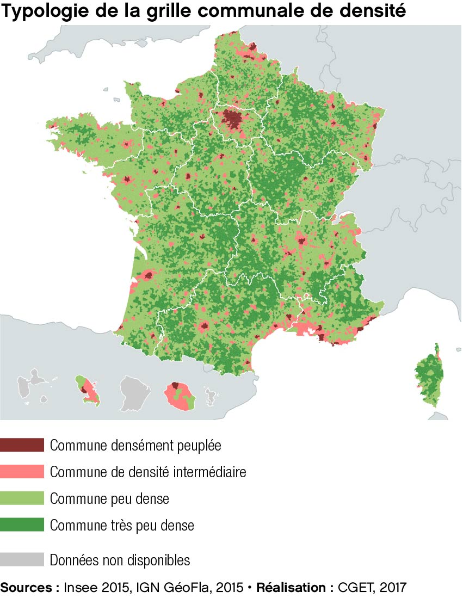

```{r setup_data, include=FALSE}
options(htmltools.dir.version = FALSE)

# import des données de couverture communales
library(tidyverse)
library(data.table)
library(sf)
COMM_COUVMOB_4G_4OPE_012019.stat.FRMET.indics <- fread("./data/COMM_COUVMOB_4G_4OPE_012019.stat.FRMET.indics.csv")
COMM_COUVMOB_4G_4OPE_072017.stat.FRMET.indics <- fread("./data/COMM_COUVMOB_4G_4OPE_072017.stat.FRMET.indics.csv")
COMM_COUVMOB_4G_4OPE_012019.stat.FRDOM.indics <- fread("./data/COMM_COUVMOB_4G_4OPE_012019.stat.FRDOM.indics.csv")


```


```{r setup_carto, include=FALSE, eval=FALSE}
options(htmltools.dir.version = FALSE)

library(CARTElette)
# récupération du fonds communal france métro GEOFLA COG 2016
# COMMG_COG2016_MET <- loadMap(COG = 2016, nivsupra = "COM") %>%
#   st_set_crs(2154) %>%
#   st_transform(2154) %>%
#   mutate(DEPCOM = ifelse(substr(INSEE_COM,1,2) == '75' ,'75056',
#                          ifelse(substr(INSEE_COM,1,3) == '132' ,'13055',
#                                 ifelse(substr(INSEE_COM,1,4) == '6938' ,'69123',INSEE_COM)))) %>%
#   group_by(DEPCOM) %>%
#   summarise() %>%
#   st_buffer(dist = 0) %>%
#   rename(INSEE_COM = DEPCOM) 

COMMG_COG2016_MET <- st_read("./carto/COMMG_COG2016_MET.geojson" , stringsAsFactors = F) %>% 
  st_set_crs(2154) %>%
  st_transform(2154) %>%
  mutate(DEPCOM = ifelse(substr(INSEE_COM,1,2) == '75' ,'75056',
                         ifelse(substr(INSEE_COM,1,3) == '132' ,'13055',
                                ifelse(substr(INSEE_COM,1,4) == '6938' ,'69123',INSEE_COM)))) %>%
  group_by(DEPCOM) %>%
  summarise() %>%
  st_buffer(dist = 0) %>%
  rename(INSEE_COM = DEPCOM)

# récupération du fonds communal france DROM CGET
COMMG_DROM <- st_read("./carto/COMMG_COG2016_DROM.geojson" , stringsAsFactors = F) %>%  st_set_crs(2154) %>%
  filter(substr(CODE_DEPT,1,2) %in% '97') 

# création du fonds toute France
COMMG_COG2016_METDOM <- COMMG_COG2016_MET %>%
  select(INSEE_COM) %>%
  filter(!substr(INSEE_COM,1,2) %in% '97') %>%
  rbind(COMMG_DROM %>% select(INSEE_COM) )


## mailles supracommunales
library(migR)

geo_DEP_poly <-
  creation_carto_supracomm(CARTO_COMM = COMMG_COG2016_METDOM,
                           CODE_COMMUNE = "INSEE_COM",
                           COG_IN = 2016,
                           COG_NIVGEO = 2018,
                           NIVGEO = "DEP",
                           FORMAT = "poly",
                           SG = 0.02)


```


```{r xaringan-themer, include=FALSE}
library(xaringanthemer)
# mono_light(
#   base_color = "#1c5253",
#   header_font_google = google_font("Josefin Sans"),
#   text_font_google   = google_font("Montserrat", "300", "300i"),
#   code_font_google   = google_font("Droid Mono") )

duo_accent(primary_color = "#217d35", 
             secondary_color = "#f08008",
             header_font_google = google_font("Josefin Sans"),
  text_font_google   = google_font("Montserrat", "300", "300i"),
  code_font_google   = google_font("Droid Mono"))

```


# Sources


.pull-left[
Couches cartographiques d’emprise théorique de chaque opérateur mobile issues de l'**Arcep** sur  [data.gouv.fr](https://www.data.gouv.fr/fr/datasets/mon-reseau-mobile/). 
]
.pull-right[

]

- 2G : qualité de service TBC/BC/CL/NA.
- 4G : binaire oui-non

Diffusion : ~ chaque trimestre depuis juillet 2017.

--

-> Traitements géomatiques pour calcul de superficie couverte par commune et toutes les mailles supra-communales.

```{r }
head(COMM_COUVMOB_4G_4OPE_012019.stat.FRMET.indics)
``` 


---
class: center, animated, slideInRight
# Evolution des emprises 4G des opérateurs


.pull-left[
- 
 
- 

]
.pull-right[

```{r evol_couv_TOT_OPE, echo=F, message=F, warning=F, include = T, fig.height = 5, fig.retina=2, fig.align='center'}
# evolution de la superfice couverte par opérateur
evol_couv_FRMET_OPE_4G <- 
COMM_COUVMOB_4G_4OPE_072017.stat.FRMET.indics %>%
  group_by(techno,OPE) %>%
  summarise(superficie = sum(superficie),
            TOT.superficie = sum(TOT.superficie)) %>%
  mutate(an = 2017) %>%
  rbind.data.frame(COMM_COUVMOB_4G_4OPE_012019.stat.FRMET.indics %>%
                     group_by(techno,OPE) %>%
                     summarise(superficie = sum(superficie),
                               TOT.superficie = sum(TOT.superficie)) %>%
                     mutate(an = 2019)) %>%
  ungroup() %>%
  mutate(pct.superficie = superficie / TOT.superficie) %>%
  mutate(an = as.character(an),
         pct.superficie = round(pct.superficie*100,0)) 

library(CGPfunctions)
newggslopegraph(evol_couv_FRMET_OPE_4G , 
                an, pct.superficie, OPE,
                Title = "Part de la surface couverte en 4G",
                SubTitle = " par opérateur mobile",
                Caption = "Source : Arcep, opérateurs mobiles, janvier 2019",
                LineColor = #c("#00B050", "#984807","#558ED5","#7030A0", "#E46C0A", "#FF0000", "grey", "grey60", "black"),
                  c("dodgerblue",
                    "green",
                    "orangered",
                    "red"),
                LineThickness = 1)
```

]


---


# Analyse par la grille de densité


<!-- background-image: url("img/carte7_grille_densite-01.jpg"), url("img/logo-OT-CMJN_carre.png"); -->
<!-- background-size: 24%, 5%; -->
<!-- background-position: 90% 60%, right 10px top 10px; -->


```{r calcul_grid_dens, echo=F, message=F, warning=F, include = F}

library(migR)
GRIDENS_4G_indics <-
COMM_COUVMOB_4G_4OPE_012019.stat.FRMET.indics %>%
  mutate(an=2019) %>%
  rbind.data.frame(COMM_COUVMOB_4G_4OPE_072017.stat.FRMET.indics %>%
                     mutate(an=2017)) %>%
  ajout_nivgeo_supracomm(TABLE = . ,
                         CODE_COMMUNE = "CODE_INSEE",
                         NIVGEO = "TYPEDENS",
                         COG_IN = 2016,
                         COG_NIVGEO = 2018) %>%
  filter(!substr(CODE_INSEE,1,2) %in% '97') %>%
  select(-pct.superficie) %>%
  group_by(TYPEDENS, techno, OPE,an) %>%
  summarise_if(is.numeric, sum) %>%
  mutate(pct.superficie = superficie / TOT.superficie) %>%
  ajout_libelles_nivgeo(TABLE = .,
                        NIVGEO_IN ="TYPEDENS",
                        COG_NIVGEO = 2016) %>%
  ungroup() %>%
  mutate(LIB_TYPEDENS = factor(LIB_TYPEDENS, levels = c("Dense","Densité intermédiaire","Peu dense","Très peu dense")),
         OPE = factor(OPE, levels = c("ORF","SFR","BYT","FRE") ) ) %>%
  mutate(OPE = recode(OPE, "ORF" = "Orange", "SFR" = "SFR", "BYT" = "Bytel","FRE" = "Free"))
           

```

.pull-left[
```{r plot_grid_dens,echo=F, message=F, warning=F, fig.width=10,fig.height=6, fig.retina=2}
# graphique en ligne
library(scales)
library(hrbrthemes)
library(directlabels)

ggplot(data=GRIDENS_4G_indics ,
       aes(x=an, y = pct.superficie, 
           #label=paste0( round(pct_ind * 100,0), "%") ,
           color = LIB_TYPEDENS  )
       ) +
  geom_line(size = 2) +
  # geom_dl(aes(label = paste0( round(pct.superficie * 100,0), "%")), 
  #         method = list(dl.combine("first.points", "last.points"),
  #                                             cex = 1.5)) +
  geom_text(data=GRIDENS_4G_indics %>% filter(an ==2017),
            aes(x=an, y = pct.superficie,label=paste0( round(pct.superficie * 100,0), "%")),
    #position = position_stack(vjust = 0.5),
    hjust = 1,
    size = 3) +
  geom_text(data=GRIDENS_4G_indics %>% filter(an ==2019),
            aes(x=an, y = pct.superficie,label=paste0( round(pct.superficie * 100,0), "%")),
            #position = position_stack(vjust = 0.5),
            hjust = -0.3,
            size = 3) +
  scale_y_continuous(labels = percent_format(accuracy = 1), name = '') +
  scale_x_continuous(name = '', limits = c(2017,2019), breaks = c(2017,2019), expand=c(0, 0.5)) +
  scale_color_manual(values=c( "#84312D","#FD817F","#9DC86C", "#439B45"), name = 'Type de densité',guide=guide_legend(reverse=F)) +
  theme_ipsum_rc() +
  theme(axis.text.y = element_blank(),
        legend.position = "none",
        strip.text.x = element_text(face = "bold"),
        strip.background = element_rect(color = "grey"),
        panel.grid = element_line(linetype = "longdash")) +
  facet_grid(~OPE) +
  #coord_flip() +
  labs(
    title = "Part de la surface couverte en 4G selon la grille de densité",
    subtitle = "par opérateur mobile, en France métropolitaine",
    caption = "Source : Arcep, opérateurs mobiles, juillet 2017/janvier 2019"
  )

```
]

.pull-right[

]
---

# Diffusion sur le site cartographique OT
<iframe src="http://carto.observatoire-des-territoires.gouv.fr/index.php?indics=couverture_tel.couv4g&serie=2018&view=map56&lang=fr&maponly=1" width="650px" height="450px" frameBorder="0"></iframe>

---
class: top
background-image: url(img/logo_OT.png)
background-size: 260px
background-position: 5% 95%

# Nous contacter

.pull-right[.pull-down[

<a href="mailto:observatoire@cget.gouv.fr">
.white[`r icon::fa("paper-plane")` observatoire@cget.gouv.fr]
</a>

<a href="http:/observatoire-territoires.github.io/couv4G">
.white[`r icon::fa("link")` observatoire-territoires.github.io/couv4G]
</a>


<a href="http://github.com/observatoire-territoires">
.white[`r icon::fa("github")` @observatoire-territoires]
</a>

<br><br><br>

]]