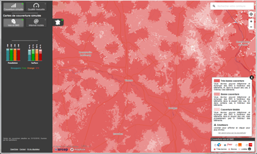
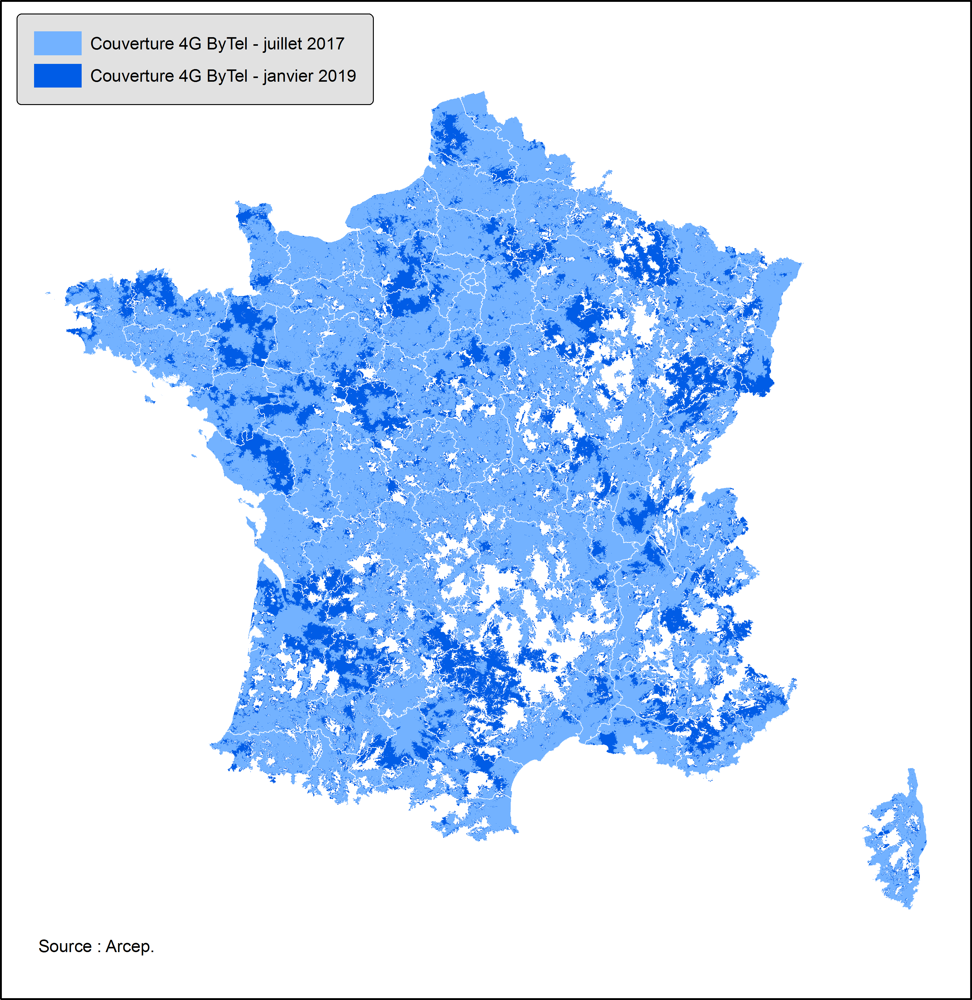
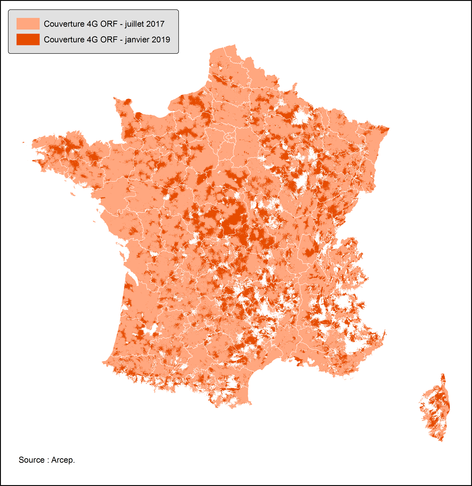
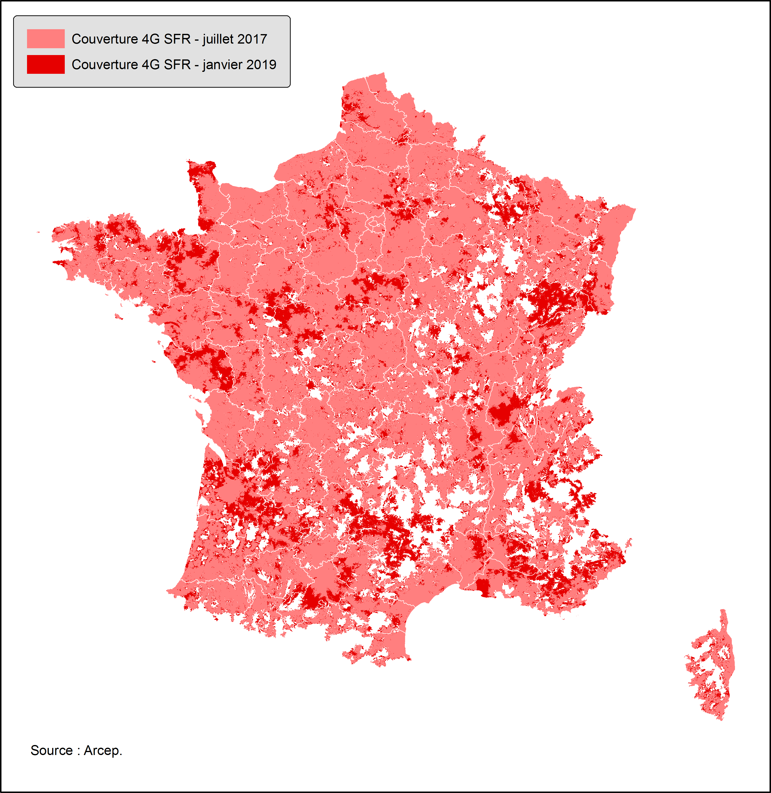
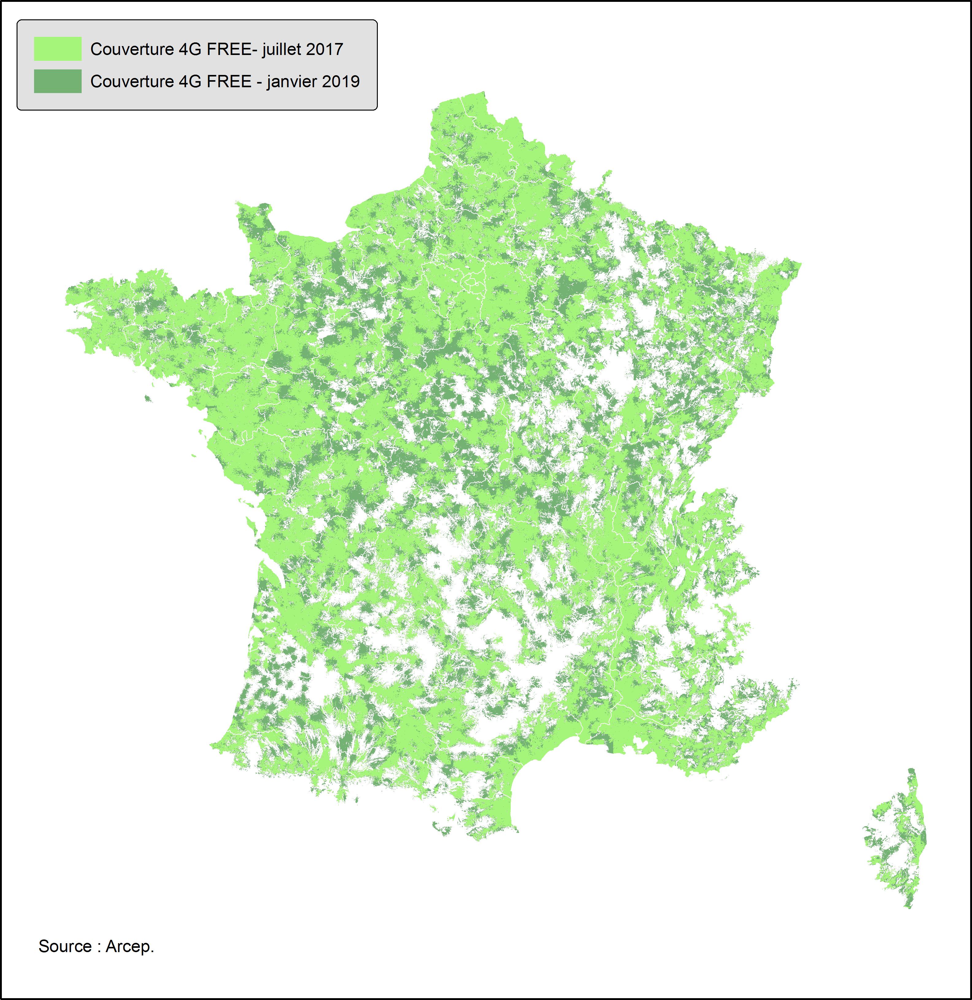

```{r setup_data, include=FALSE}
options(htmltools.dir.version = FALSE)

library(tidyverse)
library(data.table)
library(hrbrthemes)
library(sf)
library(ggrepel)
library(migR)
library(RColorBrewer)
library(ggiraph)
library(patchwork)


# import des données de couverture communales
COMM_COUVMOB_4G_4OPE_012019.stat.FRMET.indics <- fread("./data/COMM_COUVMOB_4G_4OPE_012019.stat.FRMET.indics.csv")
COMM_COUVMOB_4G_4OPE_072017.stat.FRMET.indics <- fread("./data/COMM_COUVMOB_4G_4OPE_072017.stat.FRMET.indics.csv")
COMM_COUVMOB_4G_4OPE_012019.stat.FRDOM.indics <- fread("./data/COMM_COUVMOB_4G_4OPE_012019.stat.FRDOM.indics.csv")

COMM_BDA16_4G_ORF_SFR_BYT_FRE_NA_072017 <- fread("./data/COMM_BDA16_4G_ORF_SFR_BYT_FRE_NA_072017.csv")
COMM_BDA16_4G_ORF_SFR_BYT_FRE_NA_012019 <- fread("./data/COMM_BDA16_4G_ORF_SFR_BYT_FRE_NA_012019.csv")
COMM_BDA16_DOM_4G_tous_OPE_NA_012019 <- fread("./data/COMM_BDA16_DOM_4G_tous_OPE_NA_012019.csv")

# geo_DEP_poly_FRMETDOM <- st_read("./temp/geo_DEP_poly_FRMETDOM.geojson")
# geo_EPCI_poly_FRMETDOM <- st_read("./temp/geo_EPCI_poly_FRMETDOM.geojson")

```


```{r setup_carto, include=FALSE, eval=TRUE}

library(CARTElette)
# récupération du fonds communal france métro GEOFLA COG 2016
COMMG_COG2016_MET <- loadMap(COG = 2016, nivsupra = "COM") %>%
  st_set_crs(2154) %>%
  st_transform(2154) %>%
  mutate(DEPCOM = ifelse(substr(INSEE_COM,1,2) == '75' ,'75056',
                         ifelse(substr(INSEE_COM,1,3) == '132' ,'13055',
                                ifelse(substr(INSEE_COM,1,4) == '6938' ,'69123',INSEE_COM)))) %>%
  group_by(DEPCOM) %>%
  summarise() %>%
  st_buffer(dist = 0) %>%
  rename(INSEE_COM = DEPCOM)

# COMMG_COG2016_MET <- st_read("./carto/COMMG_COG2016_MET.geojson" , stringsAsFactors = F) %>% 
#   st_set_crs(2154) %>%
#   st_transform(2154) %>%
#   mutate(DEPCOM = ifelse(substr(INSEE_COM,1,2) == '75' ,'75056',
#                          ifelse(substr(INSEE_COM,1,3) == '132' ,'13055',
#                                 ifelse(substr(INSEE_COM,1,4) == '6938' ,'69123',INSEE_COM)))) %>%
#   group_by(DEPCOM) %>%
#   summarise() %>%
#   st_buffer(dist = 0) %>%
#   rename(INSEE_COM = DEPCOM)

# récupération du fonds communal france DROM CGET
COMMG_DROM <- st_read("./carto/COMMG_COG2016_DROM.geojson" , stringsAsFactors = F) %>%  st_set_crs(2154) %>%
  filter(substr(CODE_DEPT,1,2) %in% '97') 

# création du fonds toute France
COMMG_COG2016_METDOM <- COMMG_COG2016_MET %>%
  select(INSEE_COM) %>%
  filter(!substr(INSEE_COM,1,2) %in% '97') %>%
  rbind(COMMG_DROM %>% select(INSEE_COM) )


## mailles supracommunales
library(migR)

geo_DEP_poly_FRMETDOM <-
  creation_carto_supracomm(CARTO_COMM = COMMG_COG2016_METDOM,
                           CODE_COMMUNE = "INSEE_COM",
                           COG_IN = 2016,
                           COG_NIVGEO = 2018,
                           NIVGEO = "DEP",
                           FORMAT = "poly",
                           SG = 0.02)

geo_EPCI_poly_FRMETDOM <-
  creation_carto_supracomm(CARTO_COMM = COMMG_COG2016_METDOM,
                           CODE_COMMUNE = "INSEE_COM",
                           COG_IN = 2016,
                           COG_NIVGEO = 2018,
                           NIVGEO = "EPCI",
                           FORMAT = "poly",
                           SG = 0.02)

```


```{r xaringan-themer, include=FALSE}
library(xaringanthemer)
# mono_light(
#   base_color = "#1c5253",
#   header_font_google = google_font("Josefin Sans"),
#   text_font_google   = google_font("Montserrat", "300", "300i"),
#   code_font_google   = google_font("Droid Mono") )

duo_accent(primary_color = "#217d35", 
             secondary_color = "#f08008",
             header_font_google = google_font("Josefin Sans"),
  text_font_google   = google_font("Montserrat", "300", "300i"),
  code_font_google   = google_font("Droid Mono"))

```


# Sources


.pull-left[
Couches cartographiques d’emprise théorique de chaque opérateur mobile issues de l'**Arcep** sur  [data.gouv.fr](https://www.data.gouv.fr/fr/datasets/mon-reseau-mobile/). 
]
.pull-right[

]

- 2G : qualité de service TBC/BC/CL/NA.
- 4G : binaire oui-non

Diffusion : ~ chaque trimestre depuis juillet 2017.

--

-> Traitements géomatiques pour calcul de superficie couverte par commune et toutes les mailles supra-communales.

```{r }
head(COMM_COUVMOB_4G_4OPE_012019.stat.FRMET.indics)
``` 


---
class: center, animated, slideInRight
# Evolution des emprises 4G des opérateurs


.pull-left[
- 
 
- 

]
.pull-right[

```{r evol_couv_TOT_OPE, echo=F, message=F, warning=F, include = T, fig.height = 5, fig.retina=2, fig.align='center'}
# evolution de la superfice couverte par opérateur
evol_couv_FRMET_OPE_4G <- 
COMM_COUVMOB_4G_4OPE_072017.stat.FRMET.indics %>%
  group_by(techno,OPE) %>%
  summarise(superficie = sum(superficie),
            TOT.superficie = sum(TOT.superficie)) %>%
  mutate(an = 2017) %>%
  rbind.data.frame(COMM_COUVMOB_4G_4OPE_012019.stat.FRMET.indics %>%
                     group_by(techno,OPE) %>%
                     summarise(superficie = sum(superficie),
                               TOT.superficie = sum(TOT.superficie)) %>%
                     mutate(an = 2019)) %>%
  ungroup() %>%
  mutate(pct.superficie = superficie / TOT.superficie) %>%
  mutate(an = as.character(an),
         pct.superficie = round(pct.superficie*100,0)) 

library(CGPfunctions)
newggslopegraph(evol_couv_FRMET_OPE_4G , 
                an, pct.superficie, OPE,
                Title = "Part de la surface couverte en 4G",
                SubTitle = " par opérateur mobile",
                Caption = "Source : Arcep, opérateurs mobiles, janvier 2019",
                LineColor = #c("#00B050", "#984807","#558ED5","#7030A0", "#E46C0A", "#FF0000", "grey", "grey60", "black"),
                  c("dodgerblue",
                    "green",
                    "orangered",
                    "red"),
                LineThickness = 1)
```

]


---
# Zones noire / grise / blanche
### juillet 2017
```{r calcul_nb_operateurs_s, echo=F, message=F, warning=F, include = F}

stats_croiz_superfice_nboperateur <-
  COMM_BDA16_4G_ORF_SFR_BYT_FRE_NA_072017  %>%
  mutate(zone = "FRMET") %>%
  mutate(an = 2017) %>%
  rbind.data.frame(COMM_BDA16_4G_ORF_SFR_BYT_FRE_NA_012019 %>%
                     mutate(zone = "FRMET") %>%
                     mutate(an = 2019)) %>%
  mutate(nb_OPE_couv = case_when(couvs_OPE %in% '' ~ 0,
                                 couvs_OPE %in% c('NA_BYT_NA_NA','ORF_NA_NA_NA','NA_NA_NA_FRE','NA_NA_SFR_NA') ~ 1,
                                 couvs_OPE %in% c('NA_BYT_NA_FRE','ORF_BYT_NA_NA','NA_BYT_SFR_NA','ORF_NA_NA_FRE','NA_NA_SFR_FRE', 'ORF_NA_SFR_NA') ~ 2,
                                 couvs_OPE %in% c('ORF_BYT_NA_FRE','NA_BYT_SFR_FRE','ORF_BYT_SFR_NA','ORF_NA_SFR_FRE') ~ 3,
                                 couvs_OPE %in% c('ORF_BYT_SFR_FRE') ~ 4) ) %>%
  select(CODE_INSEE, superficie, techno,nb_OPE_couv,zone,an) %>%
  # # DOM
  # rbind.data.frame(COMM_BDA16_DOM_4G_tous_OPE_NA_012019 %>%
  #                    mutate(an = 2019) %>%
  # mutate(nb_OPE_couv = case_when(couvs_OPE %in% 'NA_NA_NA' ~ 0,
  #                                couvs_OPE %in% c('NA_OMT_NA','ORA_NA_NA','NA_NA_DIG','NA_NA_FRE','NA_SRR_NA','ORA_NA','NA_SRR') ~ 1,
  #                                couvs_OPE %in% c('ORA_SRR','ORA_OMT_NA','NA_OMT_DIG','ORA_NA_DIG','ORA_SRR_NA', 'NA_SRR_FRE','ORA_NA_FRE') ~ 2,
  #                                couvs_OPE %in% c('ORA_SRR_FRE','ORA_OMT_DIG') ~ 3) ) %>%
  # select(CODE_INSEE, superficie, techno,nb_OPE_couv,zone,an) ) %>%
  group_by(an, nb_OPE_couv) %>%
  summarise(sup = sum(superficie, na.rm = T)) %>%
  mutate(pct_sup = sup / sum(sup)) %>%
  arrange(nb_OPE_couv, nb_OPE_couv) %>%
  mutate(nb_OPE_couv.f = factor(nb_OPE_couv, levels = c("0","1","2","3","4")) )
           

```

.pull-left[
```{r plot_nb_operateurs_s_072017,echo=F, message=F, warning=F, fig.width=10,fig.height=8, fig.retina=2}

library(treemapify)

ggplot(stats_croiz_superfice_nboperateur %>%
         filter(an %in% 2017), 
       aes(area = pct_sup, fill = nb_OPE_couv.f, 
           subgroup = nb_OPE_couv.f, 
           label = paste0( round(pct_sup * 100,0), "%"))) +
  geom_treemap(start = "bottomleft", layout = "fixed") +
  geom_treemap_text( layout = "fixed", grow = F, reflow = T, colour = "black") +
  geom_treemap_subgroup_border(layout = "fixed", colour = "black", size =1) +
  scale_fill_brewer(labels = rev(c('4 opérateurs', '3 opérateurs', '2 opérateurs', '1 opérateur','Zone blanche' )),palette = "Purples", name ="", guide=guide_legend(reverse=T)) +
  theme_ipsum_rc() +
  theme(axis.text.y = element_blank(),
        legend.text=element_text(size=15),
        strip.text.x = element_text(face = "bold"),
        strip.background = element_rect(color = "grey"),
        panel.grid = element_line(linetype = "longdash")) +
  labs(
    title = "Part de la surface couverte en 4G selon le nombre d'opérateurs présents",
    subtitle = "en France métropolitaine",
    caption = "Source : Arcep, opérateurs mobiles, juillet 2017/janvier 2019"
  )
```
]

.pull-right[

]

---
# Zones noire / grise / blanche
### janvier 2019

.pull-left[
```{r plot_nb_operateurs_s_012019,echo=F, message=F, warning=F, fig.width=10,fig.height=8, fig.retina=2}

ggplot(stats_croiz_superfice_nboperateur %>%
         filter(an %in% 2019), 
       aes(area = pct_sup, fill = nb_OPE_couv.f, 
           subgroup = nb_OPE_couv.f, 
           label = paste0( round(pct_sup * 100,0), "%"))) +
  geom_treemap(start = "bottomleft", layout = "fixed") +
  geom_treemap_text( layout = "fixed", grow = F, reflow = T, colour = "black") +
  geom_treemap_subgroup_border(layout = "fixed", colour = "black", size =1) +
  scale_fill_brewer(labels = rev(c('4 opérateurs', '3 opérateurs', '2 opérateurs', '1 opérateur','Zone blanche' )),palette = "Purples", name ="", guide=guide_legend(reverse=T)) +
  theme_ipsum_rc() +
  theme(axis.text.y = element_blank(),
        legend.text=element_text(size=15),
        strip.text.x = element_text(face = "bold"),
        strip.background = element_rect(color = "grey"),
        panel.grid = element_line(linetype = "longdash")) +
  labs(
    title = "Part de la surface couverte en 4G selon le nombre d'opérateurs présents",
    subtitle = "en France métropolitaine",
    caption = "Source : Arcep, opérateurs mobiles, juillet 2017/janvier 2019"
  )
```
]

.pull-right[

]


---
# Zone noire, grise et blanche par région

```{r calcul_nb_operateurs_s_region, echo=F, message=F, warning=F, include = F}

# par région
stats_croiz_superfice_nboperateur_REG <-
  COMM_BDA16_4G_ORF_SFR_BYT_FRE_NA_072017  %>%
  mutate(zone = "FRMET") %>%
  mutate(an = 2017) %>%
  rbind.data.frame(COMM_BDA16_4G_ORF_SFR_BYT_FRE_NA_012019 %>%
                     mutate(zone = "FRMET") %>%
                     mutate(an = 2019)) %>%
  mutate(nb_OPE_couv = case_when(couvs_OPE %in% '' ~ 0,
                                 couvs_OPE %in% c('NA_BYT_NA_NA','ORF_NA_NA_NA','NA_NA_NA_FRE','NA_NA_SFR_NA') ~ 1,
                                 couvs_OPE %in% c('NA_BYT_NA_FRE','ORF_BYT_NA_NA','NA_BYT_SFR_NA','ORF_NA_NA_FRE','NA_NA_SFR_FRE', 'ORF_NA_SFR_NA') ~ 2,
                                 couvs_OPE %in% c('ORF_BYT_NA_FRE','NA_BYT_SFR_FRE','ORF_BYT_SFR_NA','ORF_NA_SFR_FRE') ~ 3,
                                 couvs_OPE %in% c('ORF_BYT_SFR_FRE') ~ 4) ) %>%
  select(CODE_INSEE, superficie, techno,nb_OPE_couv,zone,an) %>%
  # DOM
  rbind.data.frame(COMM_BDA16_DOM_4G_tous_OPE_NA_012019 %>%
                     mutate(an = 2019) %>%
                     mutate(nb_OPE_couv = case_when(couvs_OPE %in% c('NA_NA_NA','NA_NA') ~ 0,
                                                    couvs_OPE %in% c('NA_OMT_NA','ORA_NA_NA','NA_NA_DIG','NA_NA_FRE','NA_SRR_NA','ORA_NA','NA_SRR') ~ 1,
                                                    couvs_OPE %in% c('ORA_SRR','ORA_OMT_NA','NA_OMT_DIG','ORA_NA_DIG','ORA_SRR_NA', 'NA_SRR_FRE','ORA_NA_FRE') ~ 2,
                                                    couvs_OPE %in% c('ORA_SRR_FRE','ORA_OMT_DIG') ~ 3) ) %>%
                     select(CODE_INSEE, superficie, techno,nb_OPE_couv,zone,an) ) %>%

  ajout_nivgeo_supracomm(TABLE = . ,
                         CODE_COMMUNE = "CODE_INSEE",
                         NIVGEO = "REG",
                         COG_IN = 2016,
                         COG_NIVGEO = 2018) %>%
  group_by(an, techno, REG, nb_OPE_couv) %>%
  summarise(sup = sum(superficie, na.rm = T)) %>%
  mutate(pct_sup = sup / sum(sup)) %>%
  ajout_libelles_nivgeo(TABLE = .,
                        NIVGEO_IN ="REG",
                        COG_NIVGEO = 2016) %>%
  mutate(pct_sup = sup / sum(sup)) %>%
  arrange(nb_OPE_couv, nb_OPE_couv) %>%
  mutate(nb_OPE_couv.f = factor(nb_OPE_couv, levels = c("0","1","2","3","4")) ) %>%
  # différence de libellé pour geofacet
  mutate(LIB_REG = case_when(LIB_REG %in% 'La Réunion' ~"Réunion", TRUE ~LIB_REG)) 

```

```{r plot_nb_operateurs_s_reg_012019,echo=F, message=F, warning=F, fig.width=12,fig.height=7, fig.retina=5}


library(geofacet)

ggplot(data = stats_croiz_superfice_nboperateur_REG %>% 
         #filter(!substr(REG,1,1) %in% "0") %>%
         #filter(LIB_REG_ordre %in% c('Guadeloupe','Martinique','Guyane','La Réunion','Mayotte')) %>%
         filter(an == 2019), 
       aes(area = pct_sup, fill = nb_OPE_couv.f, 
           subgroup = nb_OPE_couv.f, 
           label = paste0( round(pct_sup * 100,0), "%"))) +
  geom_treemap(start = "bottomleft", layout = "fixed") +
  geom_treemap_text( layout = "fixed", grow = F, reflow = T, colour = "black") +
  geom_treemap_subgroup_border(layout = "fixed", colour = "black", size =1) +
  #facet_wrap( ~ LIB_REG) +
  facet_geo(~ LIB_REG, grid = "fr_regions_grid1") +
  scale_fill_brewer(labels = rev(c('4 opérateurs', '3 opérateurs', '2 opérateurs', '1 opérateur','Zone blanche' )),
                    palette = "Purples", name ="", guide=guide_legend(reverse=T)) +
  #theme_ipsum() +
  theme(axis.text.y = element_blank(),
        legend.text=element_text(size=15),
        strip.text.x = element_text(face = "bold"),
        strip.background = element_rect(color = "grey"),
        panel.grid = element_line(linetype = "longdash")) +
  labs(
    title = "Part de la surface couverte en 4G selon le nombre d'opérateurs présents",
    subtitle = "par région administrative",
    caption = "Source : Arcep, opérateurs mobiles, janvier 2019"
  )


```

---
class: top
background-image: url(./img/carte7_grille_densite-01.jpg)
background-size: 260px
background-position: 88% 50%
# Analyse par la grille de densité


```{r calcul_grid_dens, echo=F, message=F, warning=F, include = F}

library(migR)
GRIDENS_4G_indics <-
COMM_COUVMOB_4G_4OPE_012019.stat.FRMET.indics %>%
  mutate(an=2019) %>%
  rbind.data.frame(COMM_COUVMOB_4G_4OPE_072017.stat.FRMET.indics %>%
                     mutate(an=2017)) %>%
  ajout_nivgeo_supracomm(TABLE = . ,
                         CODE_COMMUNE = "CODE_INSEE",
                         NIVGEO = "TYPEDENS",
                         COG_IN = 2016,
                         COG_NIVGEO = 2018) %>%
  filter(!substr(CODE_INSEE,1,2) %in% '97') %>%
  select(-pct.superficie) %>%
  group_by(TYPEDENS, techno, OPE,an) %>%
  summarise_if(is.numeric, sum) %>%
  mutate(pct.superficie = superficie / TOT.superficie) %>%
  ajout_libelles_nivgeo(TABLE = .,
                        NIVGEO_IN ="TYPEDENS",
                        COG_NIVGEO = 2016) %>%
  ungroup() %>%
  mutate(LIB_TYPEDENS = factor(LIB_TYPEDENS, levels = c("Dense","Densité intermédiaire","Peu dense","Très peu dense")),
         OPE = factor(OPE, levels = c("ORF","SFR","BYT","FRE") ) ) %>%
  mutate(OPE = recode(OPE, "ORF" = "Orange", "SFR" = "SFR", "BYT" = "Bytel","FRE" = "Free"))


           

```

```{r plot_grid_dens,echo=F, message=F, warning=F, fig.width=10,fig.height=7, fig.retina=2}
# graphique en ligne
library(scales)
library(hrbrthemes)
library(directlabels)

ggplot(data=GRIDENS_4G_indics ,
       aes(x=an, y = pct.superficie, 
           #label=paste0( round(pct_ind * 100,0), "%") ,
           color = LIB_TYPEDENS  )
       ) +
  geom_line(size = 2) +
  # geom_dl(aes(label = paste0( round(pct.superficie * 100,0), "%")), 
  #         method = list(dl.combine("first.points", "last.points"),
  #                                             cex = 1.5)) +
  geom_text(data=GRIDENS_4G_indics %>% filter(an ==2017),
            aes(x=an, y = pct.superficie,label=paste0( round(pct.superficie * 100,0), "%")),
    #position = position_stack(vjust = 0.5),
    hjust = 1,
    size = 3) +
  geom_text(data=GRIDENS_4G_indics %>% filter(an ==2019),
            aes(x=an, y = pct.superficie,label=paste0( round(pct.superficie * 100,0), "%")),
            #position = position_stack(vjust = 0.5),
            hjust = -0.3,
            size = 3) +
  scale_y_continuous(labels = percent_format(accuracy = 1), name = '') +
  scale_x_continuous(name = '', limits = c(2017,2019), breaks = c(2017,2019), expand=c(0, 0.5)) +
  scale_color_manual(values=c( "#84312D","#FD817F","#9DC86C", "#439B45"), name = 'Type de densité',guide=guide_legend(reverse=F)) +
  theme_ipsum_rc() +
  theme(axis.text.y = element_blank(),
        legend.position = "none",
        strip.text.x = element_text(face = "bold"),
        strip.background = element_rect(color = "grey"),
        panel.grid = element_line(linetype = "longdash")) +
  facet_grid(~OPE) +
  #coord_flip() +
  labs(
    title = "Part de la surface couverte en 4G selon la grille de densité",
    subtitle = "par opérateur mobile, en France métropolitaine",
    caption = "Source : Arcep, opérateurs mobiles, juillet 2017/janvier 2019"
  )

```


---

# Couverture de l'opérateur mieux-disant


```{r calcul_opemieuxdisant_comm, echo=F, message=F, warning=F, include = F}

################################
# indicateur part de l'opérateur 4G mieux-disant par commune

COMM_COUVMOB_4G_4OPE_012019.stat.FR.indics.max <-
  COMM_COUVMOB_4G_4OPE_012019.stat.FRMET.indics %>%
  rbind.data.frame(COMM_COUVMOB_4G_4OPE_012019.stat.FRDOM.indics) %>%
  group_by(CODE_INSEE) %>%
  filter(pct.superficie == max(pct.superficie)) %>%
  distinct(CODE_INSEE, .keep_all = TRUE)


COMM_COUVMOB_4G_4OPE_072017.stat.FR.indics.max <-
  COMM_COUVMOB_4G_4OPE_072017.stat.FRMET.indics %>%
  group_by(CODE_INSEE) %>%
  filter(pct.superficie== max(pct.superficie)) %>%
  distinct(CODE_INSEE, .keep_all = TRUE)


COMM_COUVMOB_4G_4OPE_EVOL.stat.FRMET.indics.max <-
  COMM_COUVMOB_4G_4OPE_012019.stat.FR.indics.max %>%
  rename(pct.superficie.012019 = pct.superficie, superficie.012019 = superficie, OPE.072018 = OPE) %>%
  left_join(COMM_COUVMOB_4G_4OPE_072017.stat.FR.indics.max %>%
              select(CODE_INSEE,  OPE.072017 = OPE, pct.superficie.072017 = pct.superficie, superficie.072017 = superficie),
            by = c("CODE_INSEE")) %>%
  mutate(diff.pct.superficie.072017_012019 = pct.superficie.012019 - pct.superficie.072017)


```


.pull-left[
```{r plot_opemieuxdisant_actuel_comm, echo=F, message=F, warning=F, fig.width=7,fig.height=7, fig.retina=2}


# carte choroplèthe 
ggplot() +
  geom_sf(data = COMMG_COG2016_METDOM %>% 
            full_join(COMM_COUVMOB_4G_4OPE_012019.stat.FR.indics.max , 
                      by = c("INSEE_COM" ="CODE_INSEE" ) ) ,
          aes(fill=cut(pct.superficie*100, breaks = c(0,20,30,50,80,95,100))), color = NA) +
  geom_sf(data = geo_DEP_poly_FRMETDOM, color = "grey65", fill = NA ,size = 0.05) +
  scale_fill_brewer(palette = "Reds", name = "%") +
  guides(fill = guide_legend(reverse=T)) +
  labs(
    title = "Part de la surface couverte en 4G",
    subtitle = "par l'opérateur mieux-disant, par commune",
    caption = "Source : Arcep, opérateurs mobiles, juillet 2018"
  ) +   
  theme_ipsum() + 
  theme(legend.position = "right",
        axis.line=element_blank(),
        axis.title=element_blank(),
        axis.text=element_blank() )+
  coord_sf(crs = st_crs(2154), datum = NA)


```
]

.pull-right[

```{r plot_opemieuxdisant_evol_comm, echo=F, message=F, warning=F, fig.width=7,fig.height=7, fig.retina=2}
ggplot() +
  geom_sf(data = COMMG_COG2016_MET %>% select(INSEE_COM) %>%
            full_join(COMM_COUVMOB_4G_4OPE_EVOL.stat.FRMET.indics.max, 
                      by = c("INSEE_COM" ="CODE_INSEE" ) ),  #%>%
          aes(fill=cut(diff.pct.superficie.072017_012019*100, breaks = c(-100,-50,-25,-15,-7,-3,0,3,7,15,25,50,100))), color = NA) +
  geom_sf(data = geo_DEP_poly_FRMETDOM, color = "grey65", fill = NA ,size = 0.05) +
  scale_fill_manual(name = "%", values = c(rev(colorRampPalette(brewer.pal(8, "Reds"))(6)) ,colorRampPalette(brewer.pal(8, "Greens"))(6) )  , drop = FALSE) +
  guides(fill = guide_legend(reverse=T)) +
  labs(
    title = "Evolution de la part de la surface couverte en 4G par l'opérateur mieux-disant",
    subtitle = "Entre juillet 2017 et janvier 2019, par commune",
    caption = "Source : Arcep, opérateurs mobiles, janvier 2019"
  ) +   
  theme_ipsum() + 
  theme(legend.position = "right",
        axis.line=element_blank(),
        axis.title=element_blank(),
        axis.text=element_blank() )+
  coord_sf(crs = st_crs(2154), datum = NA)
```
]

---
# Opérateur mieux-disant par EPCI


```{r calcul_epci_mieuxdisant, include=FALSE, eval=TRUE}


# stats ope mieux-disant par EPCI
EPCI_COUVMOB_4G_4OPE_012019.stat.FR.indics.max <-
  COMM_COUVMOB_4G_4OPE_072017.stat.FRMET.indics %>% mutate(an = 2017) %>%
  rbind.data.frame(COMM_COUVMOB_4G_4OPE_012019.stat.FRMET.indics %>% mutate(an = 2019) ) %>%
  rbind.data.frame(COMM_COUVMOB_4G_4OPE_012019.stat.FRDOM.indics %>% mutate(an = 2019)) %>%
  #rbind.data.frame(COMM_COUVMOB_4G_4OPE_012019.stat.FRDOM.indics) %>%
  ajout_nivgeo_supracomm(TABLE = . ,
                         CODE_COMMUNE = "CODE_INSEE",
                         NIVGEO = "EPCI",
                         COG_IN = 2016,
                         COG_NIVGEO = 2018) %>%
  group_by(EPCI,techno, OPE, an) %>%
  summarise_if(is.numeric, sum) %>%
  mutate(pct.superficie = superficie / TOT.superficie) %>%
  ungroup() %>%
  group_by(EPCI,techno, an) %>%
  # indicateur de l'opérateur mieux-disant par techno / par an
  filter(pct.superficie == max(pct.superficie)) %>%
  distinct(EPCI, .keep_all = TRUE) %>%
  ungroup() %>%
  select(EPCI,OPE,techno, an,  superf_tot = TOT.superficie, superf_opemax = superficie ) %>%
  mutate(pct_superf_opemax = superf_opemax / superf_tot) %>%
  ajout_libelles_nivgeo(TABLE = .,
                        NIVGEO_IN ="EPCI",
                        COG_NIVGEO = 2018) %>%
  select(EPCI, LIB_EPCI, an ,OPE, pct_superf_opemax, superf_tot) %>%
  mutate(an = as.character(an)) %>%
  mutate(OPE = factor(OPE, levels = c("ORF","SFR","BYT","FRE") ) ) %>%
  mutate(OPE = recode(OPE, "ORF" = "Orange", "SFR" = "SFR", "BYT" = "Bytel","FRE" = "Free"))


# fonction pour gérer accents
conv_accents <- function(x) {
  x <- gsub(pattern = "è", replacement = "&egrave;", x = x)
  x <- gsub(pattern = "é", replacement = "&eacute;", x = x)
  x <- gsub(pattern = "ê", replacement = "&ecirc;", x = x)
  x <- gsub(pattern = "ë", replacement = "&euml;", x = x)
  x <- gsub(pattern = "î", replacement = "&icirc;", x = x)
  x <- gsub(pattern = "ï", replacement = "&iuml;", x = x)
  x <- gsub(pattern = "û", replacement = "&ucirc;", x = x)
  x <- gsub(pattern = "ü", replacement = "&uuml;", x = x)
  x <- gsub(pattern = "ô", replacement = "&ocirc;", x = x)
  x <- gsub(pattern = "à", replacement = "&agrave;", x = x)
  x <- gsub(pattern = "â", replacement = "&acirc;", x = x)
  x <- gsub(pattern = "ç", replacement = "&ccedil;", x = x)
  x <- gsub(pattern = "è", replacement = "&Egrave;", x = x)
  x <- gsub(pattern = "é", replacement = "&Eacute;", x = x)
  x <- gsub(pattern = "ê", replacement = "&Ecirc;", x = x)
  x <- gsub(pattern = "ë", replacement = "&Euml;", x = x)
  x <- gsub(pattern = "î", replacement = "&Icirc;", x = x)
  x <- gsub(pattern = "ï", replacement = "&Iuml;", x = x)
  x <- gsub(pattern = "û", replacement = "&Ucirc;", x = x)
  x <- gsub(pattern = "ü", replacement = "&Uuml;", x = x)
  x <- gsub(pattern = "ô", replacement = "&Ocirc;", x = x)
  x <- gsub(pattern = "à", replacement = "&Agrave;", x = x)
  x <- gsub(pattern = "â", replacement = "&Acirc;", x = x)
  x <- gsub(pattern = "ç", replacement = "&Ccedil;", x = x)
  x <- gsub(pattern = "'", replacement = "&apos;", x = x)
  
  return(x)
}


ggi_choro <-
  ggplot() +
  geom_sf_interactive(data = geo_EPCI_poly_FRMETDOM %>% 
                        full_join(EPCI_COUVMOB_4G_4OPE_012019.stat.FR.indics.max %>%
                                    filter(an %in% '2019'), 
                                  by = c("EPCI" ="EPCI" ) ) %>%
                        mutate(tip = paste0("<style> div.leaflet-popup-content {width:auto!important;}</style>",
                                            "<font size=2.5 color=white family=Roboto>","<b>",conv_accents(LIB_EPCI) ,"</b>","<br>",
                                            "superficie totale :", format(round(superf_tot / 1000000,-1), nsmall=0, big.mark=" "), " km2","<br>",
                                            "<b>",percent(pct_superf_opemax, accuracy = 0.1) ,"</b>"," de la superficie est couverte " , "<br>",
                                            "par ","<i>",OPE ,"</i>"," (operateur mieux-disant sur ce territoire)","</font>") ),
                      # mutate(tip = paste0("<style> div.leaflet-popup-content {width:auto!important;}</style>",
                      #                     "<font size=2.5 color=white family=Roboto>","<b>",conv_accents(LIB_EPCI) ,"</b>","<br>",
                      #                     "superficie totale :", format(round(superf_tot / 1000000,-1), nsmall=0, big.mark=" "), " km2","<br>",
                      #                     "<b>",percent(pct_superf_opemax, accuracy = 0.01) ,"</b>"," de la superficie est couverte " , "<br>","</font>") ),
                      aes(fill=cut(pct_superf_opemax*100, breaks = c(0,20,30,50,80,95,100.01)),
                          tooltip = tip,
                          data_id = EPCI), color = NA) +
  geom_sf(data = geo_DEP_poly_FRMETDOM, color = "grey65", fill = NA ,size = 0.05) +
  scale_fill_brewer(palette = "Reds", name = "%") +
  guides(fill = guide_legend(reverse=T)) +
  labs(
    title = "Part de la surface couverte en 4G",
    subtitle = "par l'opérateur mieux-disant, par commune",
    caption = "Source : Arcep, opérateurs mobiles, janvier 2019"
  ) +   
  theme_ipsum() + 
  theme(legend.position = "right",
        axis.line=element_blank(),
        axis.title=element_blank(),
        axis.text=element_blank() ) #+
  #coord_sf(crs = 2154, datum = NA)


EPCI_COUVMOB_4G_4OPE_EVOL.stat.FRMET.indics.max <-
  EPCI_COUVMOB_4G_4OPE_012019.stat.FR.indics.max %>%
  select(EPCI, an, pct_superf_opemax) %>%
  spread(an , pct_superf_opemax) %>%
  rename(pct.superficie.012019 = `2019`,pct.superficie.072017 = `2017`) %>%
  mutate(diff.pct.superficie.072017_012019 = pct.superficie.012019 - pct.superficie.072017)


ggi_choro_evol <-
ggplot() +
  geom_sf_interactive(data = geo_EPCI_poly_FRMETDOM %>% 
                        full_join(EPCI_COUVMOB_4G_4OPE_012019.stat.FR.indics.max %>%
                                    filter(an %in% '2019'), 
                                  by = c("EPCI" ="EPCI" ) ) %>%
                        left_join(EPCI_COUVMOB_4G_4OPE_EVOL.stat.FRMET.indics.max, by = "EPCI") %>%
                        mutate(tip = paste0("<style> div.leaflet-popup-content {width:auto!important;}</style>",
                                            "<font size=2.5 color=white family=Roboto>","<b>",conv_accents(LIB_EPCI) ,"</b>","<br>",
                                            "superficie totale :", format(round(superf_tot / 1000000,-1), nsmall=0, big.mark=" "), " km2","<br>",
                                            "<b>",percent(pct_superf_opemax, accuracy = 0.1) ,"</b>"," de la superficie est couverte " , "<br>",
                                            "par ","<i>",OPE ,"</i>"," (operateur mieux-disant sur ce territoire)","</font>") ),
                      aes(fill=cut(diff.pct.superficie.072017_012019*100, breaks = c(-100,-50,-25,-15,-7,-3,0,3,7,15,25,50,100)),
                          tooltip = tip,
                          data_id = EPCI), color = NA) +
  geom_sf(data = geo_DEP_poly_FRMETDOM, color = "grey65", fill = NA ,size = 0.05) +
  scale_fill_manual(name = "%",
                    na.value = "grey",
                    values = c(rev(colorRampPalette(brewer.pal(8, "Reds"))(6)) ,colorRampPalette(brewer.pal(8, "Greens"))(6) )  , drop = FALSE) +
  guides(fill = guide_legend(reverse=T)) +
  labs(
    title = "Evolution de la part de la surface couverte en 4G par l'opérateur mieux-disant",
    subtitle = "Entre juillet 2017 et janvier 2019, par commune",
    caption = "Source : Arcep, opérateurs mobiles, janvier 2019"
  ) +   
  theme_ipsum() + 
  theme(legend.position = "right",
        axis.line=element_blank(),
        axis.title=element_blank(),
        axis.text=element_blank() ) #+
  #coord_sf(crs = 2154, datum = NA)


```

```{r plot_opemieuxdisant_epci_evol, echo=F, message=F, warning=F, fig.width=12}

tooltip_css <- "background-color:#272B30;padding:2px;font-size: 120%;color: white;opacity:0.2"

x <- girafe( code = print(ggi_choro + ggi_choro_evol + plot_layout(nrow  = 1, widths  = c(2, 2)) ),
             width_svg = 20, 
             height_svg = 10)
x <- girafe_options(x,
                    opts_hover(css = "fill:red;r:2.5pt;size:5pt;stroke:red;color:black;opacity:0.3") ,
                    #opts_hover(css = "fill:black;r:0.25pt;size:5;stroke:black") ,
                    opts_tooltip(use_fill = FALSE) , 
                    opts_toolbar(saveaspng = FALSE) )

widgetframe::frameWidget(x,width = "100%")
```


---

# Diffusion sur le site cartographique OT


<iframe width="560" height="315" src="http://carto.observatoire-des-territoires.gouv.fr/index.php?indics=couverture_tel.couv4g&serie=2018&view=map56&lang=fr&maponly=1" frameborder="0" allow="accelerometer; autoplay; encrypted-media; gyroscope; picture-in-picture" allowfullscreen></iframe>

---

# Diffusion sur le site cartographique OT 
### test geoclip sans flash
<iframe width='600' height='600' src='https://statistiques-locales.insee.fr/?view=map1&indics=bdcom.pt_log_rp&serie=2015&lang=fr&iframe=1'></iframe>

---
class: top
background-image: url(img/logo_OT.png)
background-size: 260px
background-position: 5% 95%

# Nous contacter

.pull-right[.pull-down[

<a href="mailto:observatoire@cget.gouv.fr">
.white[`r icon::fa("paper-plane")` observatoire@cget.gouv.fr]
</a>

<a href="http:/observatoire-territoires.github.io/couv4G">
.white[`r icon::fa("link")` observatoire-territoires.github.io/couv4G]
</a>


<a href="http://github.com/observatoire-territoires">
.white[`r icon::fa("github")` @observatoire-territoires]
</a>

<br><br><br>

]]